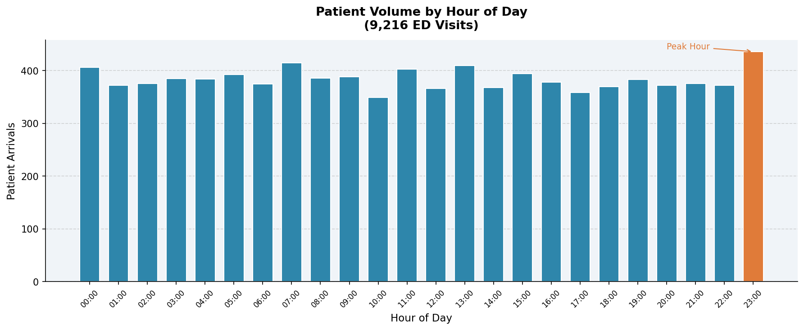
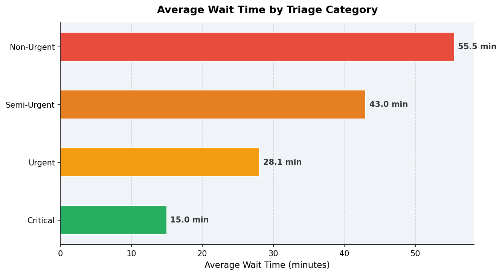
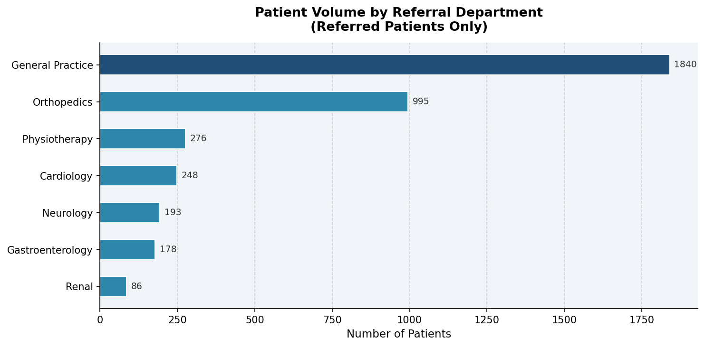
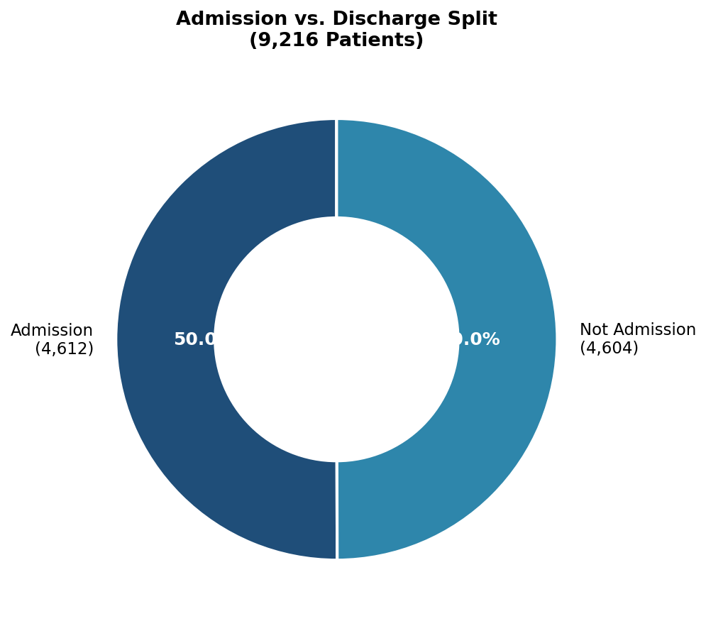
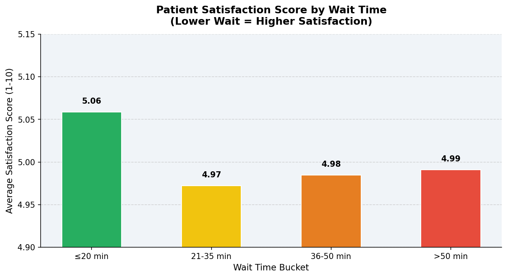

# Emergency Department Operational Analysis

> **Data-driven analysis of 9,216 patient encounters to identify bottlenecks, optimize resource utilization, and reduce wait times in a hospital Emergency Department — built with SQL, Python, and Tableau.**

---

## Project Overview

Emergency Departments face a constant pressure to do more with less: more patients, fewer beds, tighter staffing. This project uses real ED operational data to answer:

- When are patient arrivals highest, and are we staffed for it?
- Which patient categories wait the longest — and why?
- Does wait time actually impact patient satisfaction?
- Which departments are driving the most referral volume?
- What operational changes would have the biggest impact?

The analysis covers 9,216 patient visits across 2023–2024, combining SQL-based KPI development, Python EDA, and Tableau dashboards to deliver actionable recommendations to hospital leadership.

---

## Tools & Technologies

| Layer | Tool |
|---|---|
| Data Cleaning & EDA | Python, Pandas |
| Database & Queries | SQLite (10 analytical queries) |
| Visualization | Tableau, Matplotlib |
| Reporting | PowerPoint |

---

## Key Findings

- **Peak hour is 11 PM (23:00)** — 436 arrivals, yet staffing models often assume daytime peaks
- **Neurology referrals wait the longest** at 36.8 min avg vs. 34.7 min for Renal
- **Critical patients wait just 15 min** on average; Non-urgent patients wait 55.5 min — a 3.7× gap
- **Shorter waits correlate with higher satisfaction**: ≤20 min wait scores 5.06 vs. 4.97 for 21–35 min
- **Near-equal admission rate**: 50.1% admitted, 49.9% discharged — high inpatient conversion pressure
- **Weekends see 6–7% more volume** than weekdays, with Saturday as the busiest day

---

## Project Structure

```
ed-operational-analysis/
│
├── 01_schema.sql                     # SQLite schema + KPI views
├── 02_analysis_queries.sql           # 10 operational analysis queries
├── 03_eda_pipeline.py                # Full Python pipeline: clean → analyze → chart
│
├── ed_patient_flow_clean.csv         # Cleaned dataset (9,216 records, 18 columns)
│
├── chart1_volume_by_hour.png         # Patient arrivals by hour of day
├── chart2_wait_by_triage.png         # Avg wait time by triage category
├── chart3_referral_dept.png          # Volume by referral department
├── chart4_admission_split.png        # Admission vs. discharge donut
├── chart5_satisfaction_vs_wait.png   # Satisfaction score by wait time bucket
│
└── README.md
```

---

## Python Charts

**Chart 1 — Patient Volume by Hour**


**Chart 2 — Wait Time by Triage Category**


**Chart 3 — Referral Department Volume**


**Chart 4 — Admission vs. Discharge Split**


**Chart 5 — Satisfaction Score vs. Wait Time**


---

## SQL Queries (Sample)

**Overall KPIs:**
```sql
SELECT
    COUNT(*)                             AS total_patients,
    ROUND(AVG(wait_time_min), 1)         AS avg_wait_time_min,
    ROUND(AVG(satisfaction_score), 2)    AS avg_satisfaction_score,
    SUM(CASE WHEN admission_flag = 'Admission' THEN 1 ELSE 0 END) AS total_admitted
FROM ed_visits;
```

**Wait Time vs. Satisfaction:**
```sql
SELECT
    CASE
        WHEN wait_time_min <= 20 THEN 'Very Short (<= 20 min)'
        WHEN wait_time_min <= 35 THEN 'Short (21-35 min)'
        WHEN wait_time_min <= 50 THEN 'Long (36-50 min)'
        ELSE 'Very Long (> 50 min)'
    END AS wait_bucket,
    ROUND(AVG(satisfaction_score), 2) AS avg_satisfaction,
    COUNT(*) AS patient_count
FROM ed_visits
WHERE satisfaction_score IS NOT NULL
GROUP BY wait_bucket
ORDER BY avg_satisfaction DESC;
```

All 10 queries are in [`02_analysis_queries.sql`](02_analysis_queries.sql).

---

## How to Run

```bash
# 1. Clone the repo
git clone https://github.com/sirin026/ed-operational-analysis.git
cd ed-operational-analysis

# 2. Install dependencies
pip install pandas matplotlib sqlite3

# 3. Run the full pipeline
python 03_eda_pipeline.py
```

---

## Tableau Dashboard

Four interactive dashboards built in Tableau:

| Dashboard | Purpose |
|---|---|
| Executive Overview | Total patients, avg wait, LOS, throughput KPIs |
| Patient Flow Dashboard | Bottleneck identification across patient journey stages |
| Resource Utilization | Bed occupancy, shift analysis, staff utilization |
| Wait Time Heatmap | Hourly and daily congestion patterns |

---

## Recommendations

Based on the analysis, three operational changes would have the highest impact:

**1. Shift staffing to match actual peak hours** — Current peaks at 23:00 and 07:00 suggest overnight staffing is under-resourced relative to demand.

**2. Fast-track pathway for Non-Urgent patients** — This category averages 55.5-minute waits and lowest satisfaction. A dedicated low-acuity lane would free physician capacity for critical cases.

**3. Weekend surge planning** — Saturday and Sunday consistently see 6–7% higher volume. Pre-positioning extra staff on weekends reduces average wait and improves throughput.

---

## Dataset

- **Source:** Kaggle — Healthcare Emergency Department Operations Dataset
- **Records:** 9,216 patient encounters
- **Period:** January 2023 – December 2024
- **Key Fields:** Patient ID, Admission Timestamp, Triage Level, Department Referral, Wait Time (min), Satisfaction Score, Admission Flag

---

## Author

**Siri Namala**
Data & Business Analyst | SQL · Python · Tableau · Power BI
[LinkedIn](https://www.linkedin.com/in/siri-namala) · [Tableau Public](https://public.tableau.com/app/profile/siri.namala/vizzes) · [GitHub](https://github.com/sirin026)
